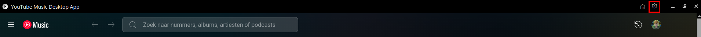
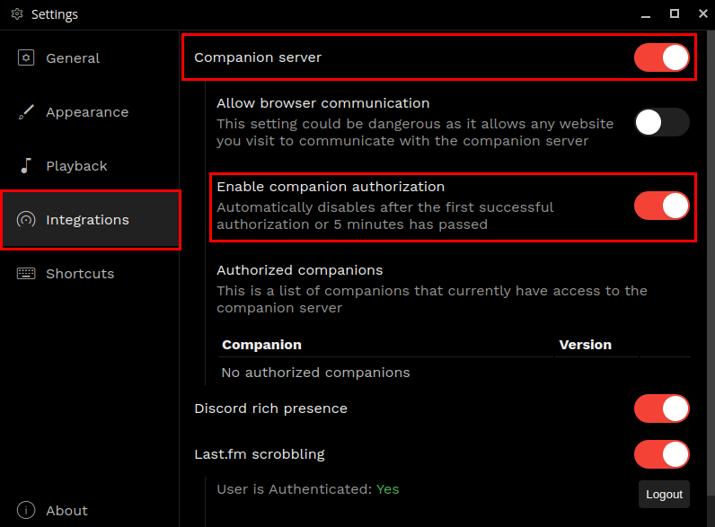
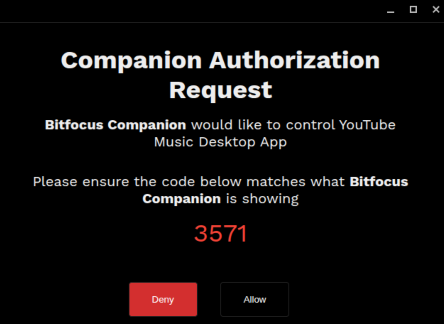
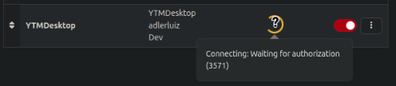

## Youtube Music Desktop

Interact with YTM Desktop (https://github.com/ytmdesktop/ytmdesktop)

### Configuration

- Open the settings menu by clicking the cog icon in the top right corner

- Open the "integrations" tab and ensure "Companion server" and "Enable companion authorization" are both checked

- Go back to Companion and click "Save" or re-enable the connection.
- A popup will appear asking you to authorize the connection.

- You can check the code by hovering over the loading icon in Companion.

- Click "Allow". The popup will close and you should see a green check in Companion.

## Available actions

- playPause (Toggle play/pause state of the player)
- play (Play)
- pause (Pause)
- volumeUp (Increase the volume of the player by 10%)
- volumeDown (Decrease the volume of the player by 10%)
- setVolume (Set the volume of the player)
- mute (Mute the player)
- unmute (Unmute the player)
- seekTo (Seek to a specific position in the currently playing track)
- next (Skip to the next track)
- previous (Go back to the previous track)
- repeatMode (Set the repeat mode of the player)
- shuffle (Enable/disable shuffle mode)
- playQueueIndex (Play a specific track from the queue)
- toggleLike (Toggle the like state of the currently playing track (note: this does not toggle like/dislike, it just toggles like/unlike))
- toggleDislike (Toggle the dislike state of the currently playing track (note: this does not toggle like/dislike, it just toggles dislike/undislike))
- changeVideo (Change the currently playing track to a specific video or playlist)

## Available feedbacks

- AlbumCover (Sets the PNG to the album cover of the currently playing track)

## Available variables

- title (Title of the currently playing track)
- artist (Artist of the currently playing track)
- volume (Volume of the player (1-100))
- duration (Duration of the currently playing track)
- trackProgress (Video progress of the player (seconds with 2 decimals))
- trackState (State of the player (unknown, paused, playing, buffering))
- videoId (Video ID of the currently playing track)
