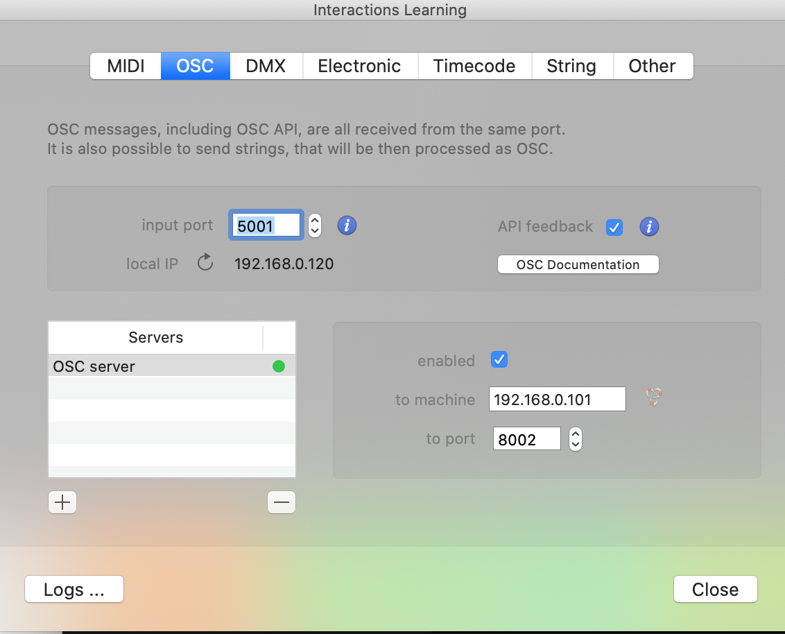
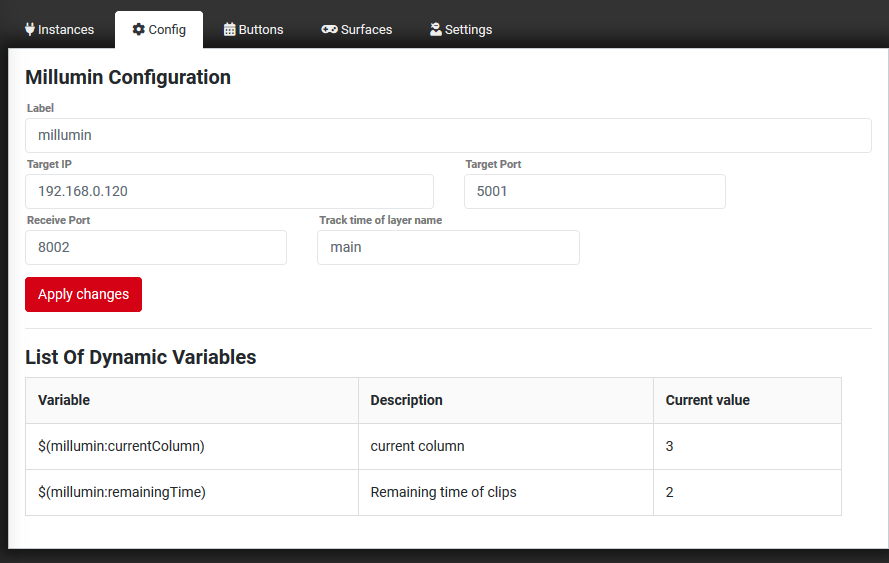

## Millumin 2, 3 and 4
Sends OSC commands to Millumin. Default port is 5000 but you can change that if needed in Millumin Interactions menu. Go to Interactions/Manage devices and from there OSC tab.

Some feedback is added, you wil need to make some settings;

> Make sure you add the name of the layer when you would like to see remaining time

**Available commands for Millumin**

* Play media on a specific Layer in a Column
* Play next column on a specific Layer
* Play previous column on a specific Layer
* Toggle Column (number)
* Launch Column (number)
* Launch Column (name)
* Goto Timeline Segment (name)
* Goto Media Normalized Time (number)
* Start Media at Column (number)
* Start (name) Media
* Next Column
* Previous Column
* Stop all Columns
* Play Timeline
* Pause Timeline
* Play or Pause Timeline
* Restart Media
* Pause Media
* Toggle Play Media
* Stop Media
