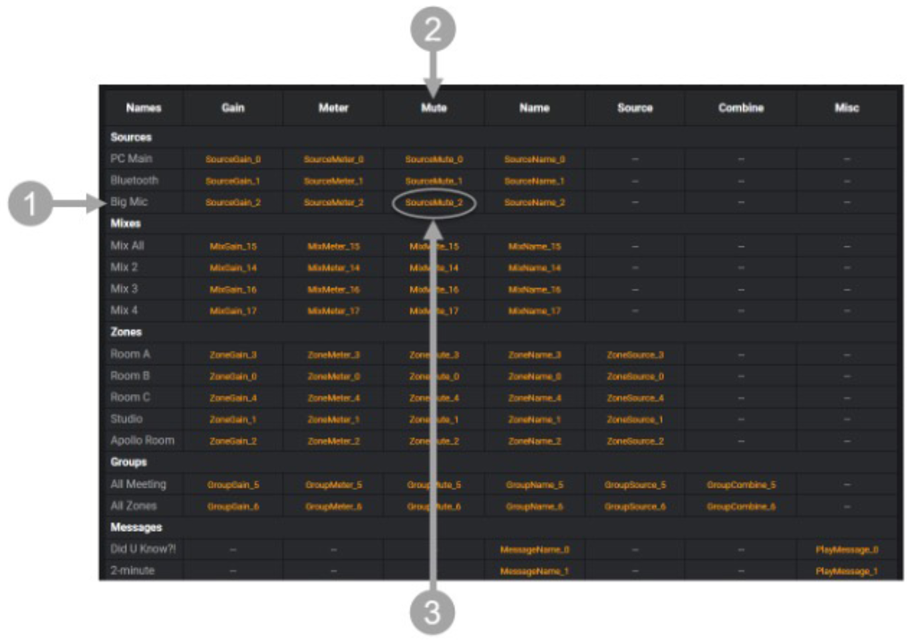

## AtlasIED Atmosphere

This module will allow you to control an AtlasIED Atmosphere AZM4/AZM8.

## Configuration
* Enter the IP address of the device in the configuration settings.
* The device will use TCP port 5321.

Third party parameter names are dynamically assigned during configuration of the AZM4/AZM8. Please refer to the Third Party Control Message Table in the User Interface under Settings>Third Party Control>Message Table for a listing of all active third-party parameter names.

## Actions

* Set Source Gain By Value
* Set Source Gain By Percent
* Bump (Increase/Decrease) Source Gain by Value
* Set Source Mute
* Set Mix Gain By Value
* Set Mix Gain By Percent
* Bump (Increase/Decrease) Mix Gain by Value
* Set Mix Mute
* Set Zone Gain By Value
* Set Zone Gain By Percent
* Bump (Increase/Decrease) Zone Gain by Value
* Set Zone Mute
* Set Zone Source (specify Source Number in Third Party Table)
* Set Group Gain By Value
* Set Group Gain By Percent
* Bump (Increase/Decrease) Group Gain by Value
* Set Group Mute
* Recall Routine
* Recall Scene

## Feedbacks

* 

## Variables

*

## Presets

* 