# BSS Soundweb Control for Companion v3

This module allows Companion to control BSS Soundweb London devices using the Direct Inject message protocol (over IP). To date, it has been tested on:

- Soundweb BLU-806DA
- Soundweb BLU-160

In theory, it should work on any Soundweb London device, providing it supports the [London Direct Inject Protocol](https://help.harmanpro.com/soundweb-london-third-party-control).

This module is only compatible with Companion v3 and will be available in Companion from `v3.3.0`.

## Getting Started

### Setting up a connection

Under the 'Add connection' tab, simply search for 'soundweb' and add the connection:

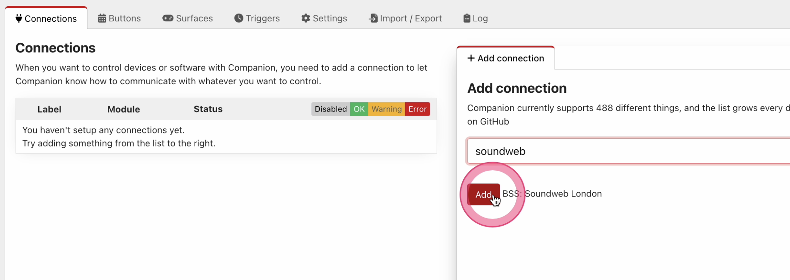

Once you have added the connection, you can select it from the list of connections and edit its configuration.

The only setting you need to provide is the <b>Gateway Node IP address</b>. This is the IP address of a single device (node) within your Soundweb deployment which can behave as a 'gateway' for Companion to communicate with all the devices in your Audio/London Architect design.

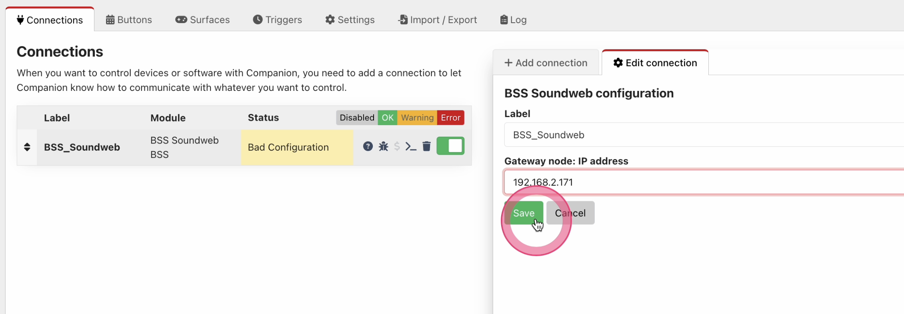

Once you've set the IP address, hit save and once Companion has successfully connected, you should see a green tick under connection status:

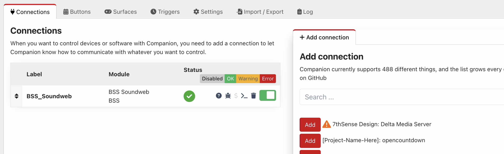

If you don't see the green tick, double check the IP address for typos and then make sure your network settings on the Soundweb device and your Companion server are also correct.  The control protocol uses a TCP connection on port `1023`, so depending on your network complexity, you may need to check your network configuration permits this connection to take place.

> <i>Note: You only need to setup one Soundweb connection per deployment/design, but you may choose to setup Companion with multiple Soundweb connections for availability reasons (because you don't want a single point of failure) or because you want Companion to communicate with devices from different designs. There should be no problem with doing this providing each connection uses a different gateway node.</i>

### Configuring your first action/feedback

The trickiest part when configuring a basic action or feedback is finding and entering the correct 'fully qualified' HiQnet address of the parameter/object you wish to control within your Soundweb design. Because Soundweb devices are based on an open architecture, users of this module must provide the full HiQnet addresses of the objects and/or parameters they wish to control.

> <i>For more a more detailed explanation on HiQnet addresses and, specifically, how they work within this module, see [HiQnet Addresses Explained](#hiqnet-addresses-explained) later in this article.</i>

### How to find a HiQnet address in your design

#### Audio Architect

There are a few ways to find a HiQnet address within Audio Architect:

- <b>Venue Explorer:</b> When in offline/edit mode, you can browse the venue tree right down to the parameter IDs of all the objects in a design.
- <b>Object Properties pane:</b> You can find the address of a selected object in the properties pane (at the bottom) under the field 'HiQnet Address'.
- <b>Parameter Address Editor:</b> When selecting a control while editing a custom control panel, you can open the Parameter Address Editor under the 'Parameters' tab and clicking on 'Addresses'.

> <i>Note: HiQnet addresses may show in Audio Architect as hexadecimal or decimal depending on how you have setup your instance of Audio Architect in 'Application Options'. In Companion, HiQnet addresses may be entered in decimal or hexadeciaml, but a `0x` prefix must be applied to hexadecimal values. e.g. A node address of `999` in decimal would be entered as `0x03E7` in hexadecimal.</i>

##### Venue Explorer

By browsing the Venue Explorer tree, you can pick out an object and/or parameter address like so:

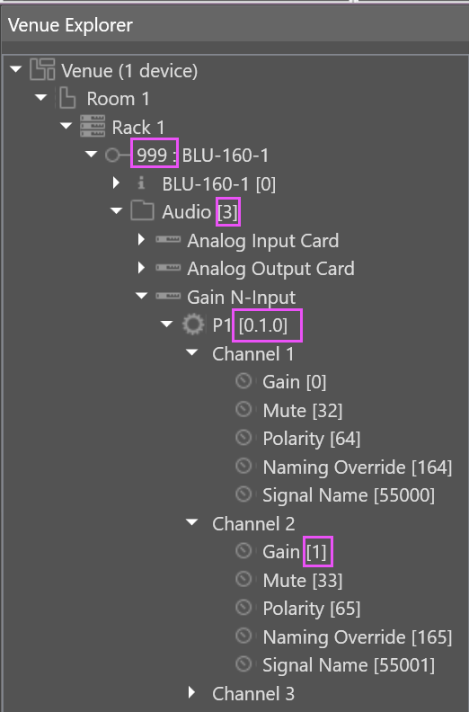

In this case, the fully qualified parameter address for the Ch2 gain control of gain object 'P1' may be entered into Companion as `999.3.0.1.0.1` (decimal representation where Node = 999, VD = 3, Object ID = 0.1.0, Parameter ID = 1).

##### Object Properties pane

When only the fully qualified object address is required, this can be found really easily by selecting an object in the design and looking up the 'HiQnet Address' in the properties pane at the bottom of the window:

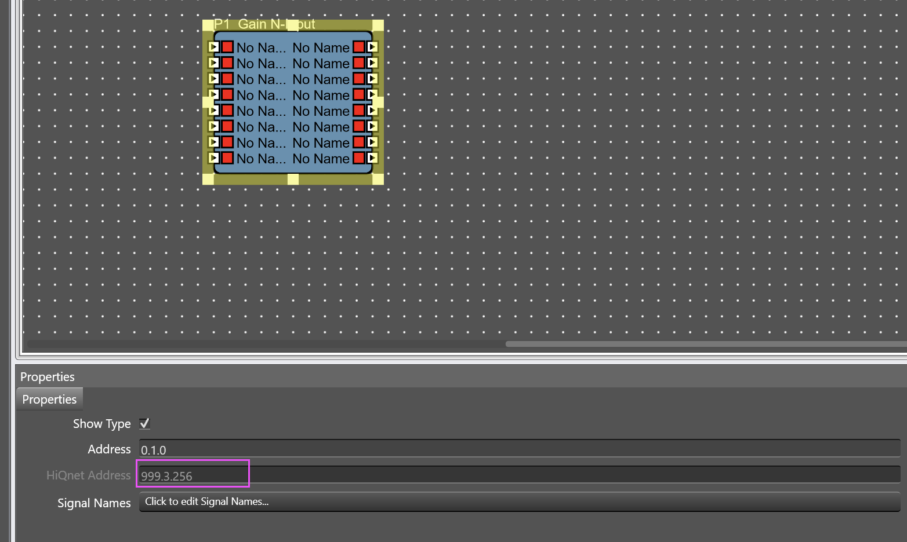

In this case, the fully qualified object address for this Gain N-Input is: `999.3.256` (decimal representation where Node = 999, VD = 3, Object ID = 256). This value can be copied and pasted straight into a 'fully qualified object address' field in Companion.

##### Parameter Address Editor

The Parameter Address Editor provides another way of browsing the parameters within your design. This tool can be accessed while editing a custom panel by selecting a control/parameter and clicking next to 'Addresses' under the 'Parameters' tab:

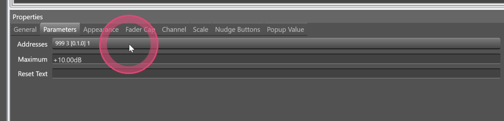

> <i>Tip: Once you have selected a control/parameter in a custom panel, the fully qualified parameter address of that control will already be shown in the Properties/Parameters tab. See above. In this example, the address shows `999 3 [0.1.0] 1`, which in Companion can translate to a parameter address of `999.3.0.1.0.1` or an object address of `999.3.0.1.0` (by simply omitting the parameter ID).</i>

The fully qualified address components can be picked out as shown with the pink boxes:

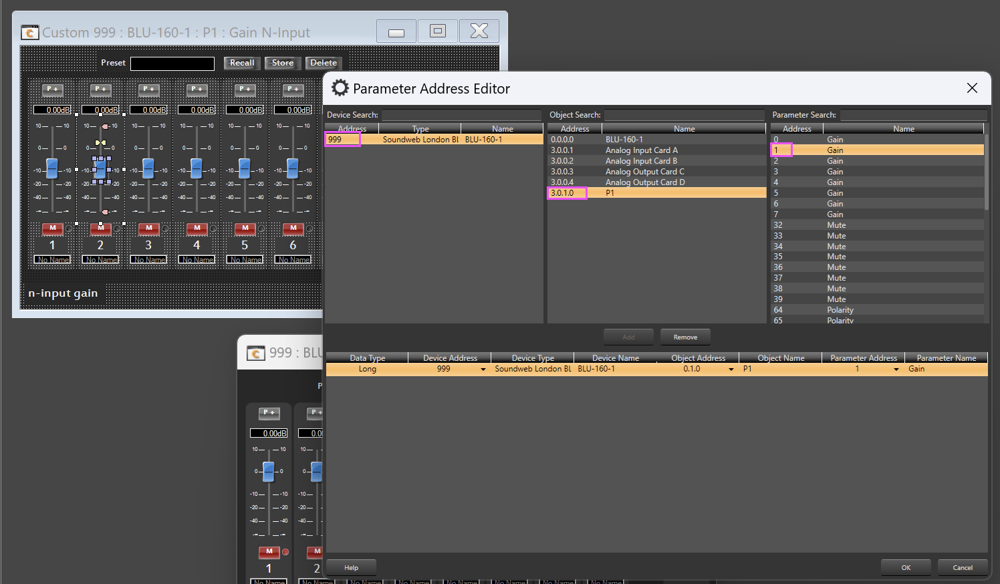

The above parameter would equate to `999.3.0.1.0.1` in Companion (decimal representation where Node = 999, VD = 3, Object ID = 0.1.0, Parameter ID = 1).

#### London Architect

In London Architect, you can use the 'London Direct Inject message tool'. Follow these step by step instructions:

1. Ensure you are running London Architect in 'offline' mode.

2. Select 'D.I Message Tool' from the 'Direct Inject' toolbar. The button/icon looks like a mini audio DI box:

   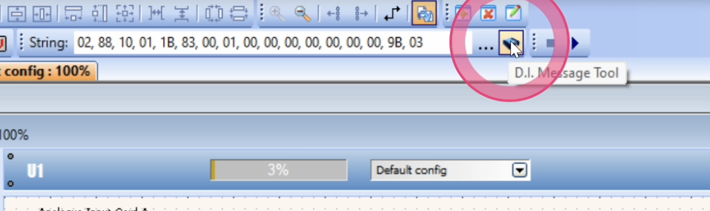

3. Within the Direct Inject message tool window, choose 'Auto-track London Architect object' from the options menu. This makes the tool update its values every time you select a parameter in London Architect. It's advisable to arrange your windows so this tool/utility is open alongside London Architect, so it doesn't keep disappearing.

   

4. Now open a control panel for an object within your design and select a control. In this case, we have opened a 'Gain N-input' and selected Ch2.

   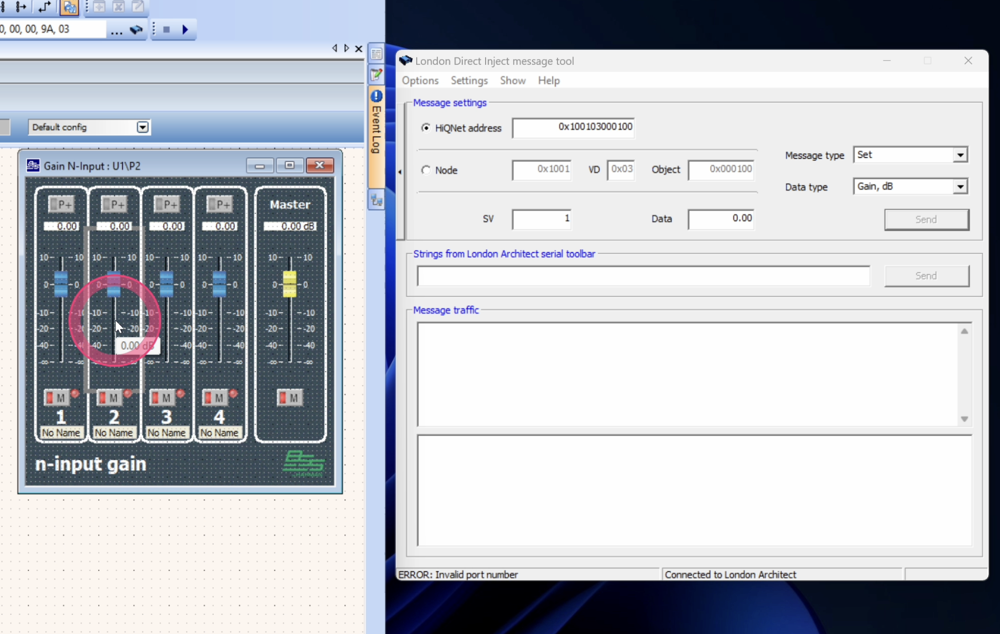

5. The Direct Inject message tool will now show the HiQnet object address for the Gain N-Input object and the parameter ID for the Ch2 gain control. The fully qualified object address is highlighted here (in Hexadecimal):

   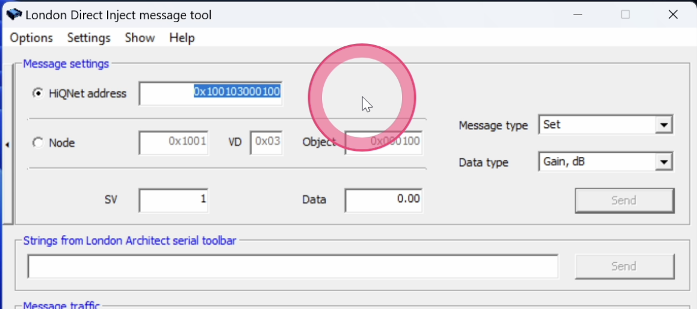

   ...and the parameter address (SV - State Variable) is highlighted here (in Decimal... just to keep you on your toes):

   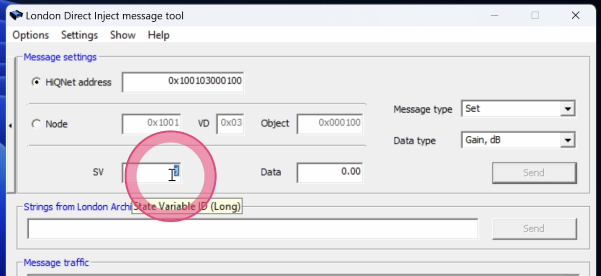

6. You can now copy and paste these values into Companion actions/feedbacks. For example:

   <b>'Set Parameter' action</b>

   In this case, we have needed to provide a 'fully qualified <b>parameter</b> address'. We can do this by taking the object address (in hex) and the parameter ID (in decimal) and combining them into a single input with a period `.` delimiter like so: `0x100103000100.1`

   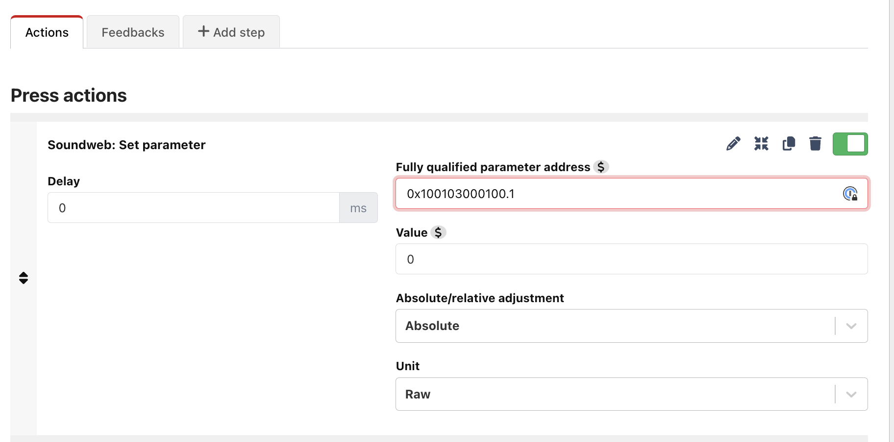

   <b>'Gain N-Input: Gain' action</b>

   In this example, because we are using an action which only requires an object address, we only need to provide the fully qualified <b>object</b> address (without the parameter ID). This means we only need to provide `0x100103000100` as the input and then we can select the channel using the 'Select channel' dropdown.

   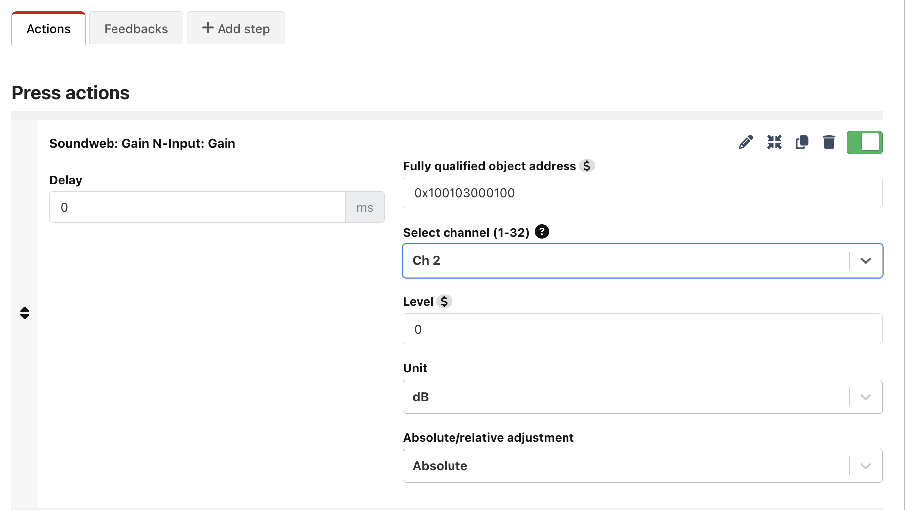

## HiQnet Addresses explained

Because Soundweb devices are based on an open architecture, users of this module must provide the HiQnet addresses of the objects and/or parameters they wish to control.

A <b>'fully qualified' HiQnet address</b> is formed from 4 parts:

#### 1. Node Address

This is the device (node) address on which the object you wish to control is located (such as a gain control, EQ, Compressor etc). It is a 2-byte value with a usable range of 1 - 65,536 (decimal).

#### 2. Virtual Device (VD) Address

Each device/node is segregated into separate logical 'sub devices'. For example, in the case of a Soundweb BLU806, these are:

- 0: Device manager
- 2: Logic
- 3: Audio

In this example, audio objects are accessed under the VD `3` and logic objects would be accessed under the VD `2`.

The Virtual Device address is represented as a 1-byte value, so has a value between 0-255 (decimal).

#### 3. Object ID

An object within the context of Soundweb devices is usually a processing object that can be placed into a design. In the case of audio processing objects, this can be something like a gain, EQ, compressor, gate, mixer etc.

The object ID is formed from three 'octets' (8-bit/1-byte values) e.g. `1.2.3`. As you place objects into a design, the third octet value is automatically incremented by one so every object in the design has a unique ID.

#### 4. Parameter ID (State variable ID)

The parameter ID (or 'state variable' ID if you are referencing older London Architect documentation) is the specific control parameter within an object that you wish to control. For example, a 'Gain N-Input' object has a number of gain controls and mutes (one of each for each channel). Each gain and mute control has its own parameter ID. This ID is represented by a 16-bit (2-byte) value.

NB: Parameter IDs are identical between objects of the same type. For example, a mute control for Ch3 of a 'Gain N-Input' will always have the same parameter ID for all 'Gain N-Input' objects within a design.

## Providing HiQnet addresses in Companion

When entering HiQnet addresses in actions and feedbacks, the address must be provided in one of the 'fully qualified' dotted formats described below.

Address fields may be provided in decimal or hexadecimal. For example, a node address with a value of 999 may be given as either:

Decimal: `999`<br>
Hexadecimal (Hex): `0x03E7`

Decimal and hexadecimal values may be used interchangeably for the various fields across a fully qualified parameter/object address. This means you can have the node address represented in hex, but the VD and Object ID represented in decimal. All hex values must be prefixed with `0x`.

> <i>Note: All the options below demonstrate fully qualified <b>parameter</b> addresses. To get the object address, simply omit the Parameter ID from the end of the address.</i>

#### Option 1 (Default)

The 'default' format used throughout the module represents a fully qualified parameter address in a dotted-decimal format across six fields. Users may supply fields in hexadecimal if they prefer.

```
[NODE].[VD].[OBJECT_1].[OBJECT_2].[OBJECT_3].[PARAMETER]
```

Examples of acceptable inputs:

```
999.3.0.1.1.0
0x03e7.0x03.0x00.0x01.0x01.0x00
```

Where:
<br>Node = <b>999</b>
<br>VD = <b>3</b>
<br>Object ID = <b>0.1.1</b>
<br>Parameter ID = <b>0</b>

#### Option 2

This option may be useful when you can only find an object ID represented as a single hexadecimal or decimal value, such as in Audio Architect when using the Object Properties pane.

```
[NODE].[VD].[OBJECT].[PARAMETER]
```

Examples of acceptable inputs:

```
999.3.0x000101.0
0x03e7.0x03.0x000101.0
999.3.257.0
```

Where:
<br>Node = <b>999</b>
<br>VD = <b>3</b>
<br>Object ID = <b>0.1.1</b>
<br>Parameter ID = <b>0</b>

#### Option 3

This option is useful when a fully qualified object address is represented in London/Audio Architect as a single hexadecimal value. The parameter ID is still supplied separately, delimited by `.`

```
[FULLY_QUALIFIED_OBJECT_ADDRESS].[PARAMETER]
```

Examples of acceptable inputs:

```
0x03e703000101.0
```

Where:
<br>Node = <b>999</b>
<br>VD = <b>3</b>
<br>Object = <b>0.1.1</b>
<br>Parameter = <b>0</b>

## Unsupported Parameters

### Time

The time parameter is used internally by the module as a makeshift watchdog/heartbeat mechanism to let the module know when nodes connect and/or disconnect etc. If you try to subscribe to the time parameter, it will not work properly.

## Module Variables

### Parameter Values

Parameter Variables show the live/current value/state of a given parameter. They can be created in different units, so a gain value (for example) may be represented in percent, decibels or as its raw value.

Parameter Variables may be created by ticking the 'Create variable?' option in a feedback or by placing a 'Parameter Variable' feedback on a button. From there you can set the desired unit within the options (More units will be supported in due course).

## Using Custom Variables in Actions & Feedbacks

For more advanced use cases, you may want to supply a variable to an action or feedback's options. This is currently supported/tested in the following cases:

### Parameter addresses

You may supply a variable for any field within the parameter address. This may be useful in a number of circumstances, but one case might be if you have a design with lots of mixer objects, and you just want to switch between the different mixers and for Companion to map one set of controls to the selected mixer.

In this situation, you can configure a custom variable in Companion called `selected_mixer` which can be set with the object addresses for the various mixers. You can then use it in a parameter address like this:

```
999.3.$(internal:custom_selected_mixer).0
```

### Gain N-Input selected channel

You may want to supply a variable to select the channel of an Gain N-Input object. For example: `$(internal:custom_selected_channel)`. This may be entered as a custom value in the dropdown menu. It must have a value in the range `1-32`.
