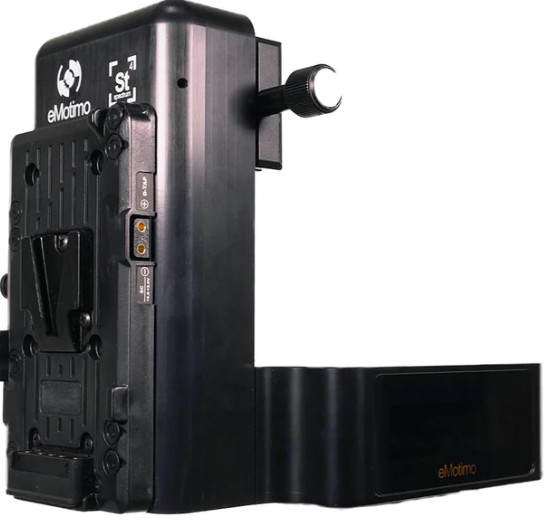
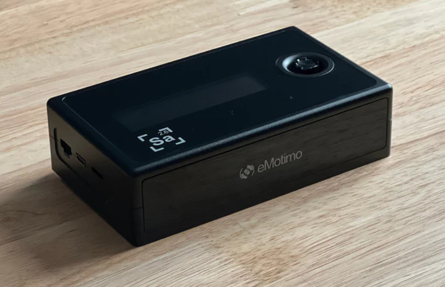
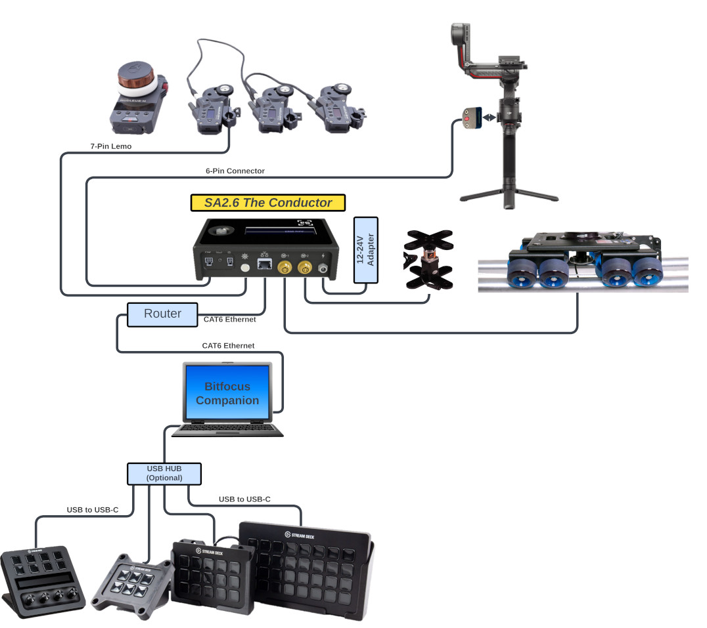

## Company Overview
eMotimo is an industry leader in motion control. We specialize in makes multi axis motion control heads for the cinema space. 

Our flagship product the [ST4](https://emotimo.com/products/st4?variant=18140355887201) is a proven motion control head that has been used in numerous productions since 2016. With it you can control Pan/Tilt/Slide and a Turntable or a Focus motor. For even more control the upgraded [ST4.3](https://emotimo.com/products/st4?variant=42138608140469) that released mid 2022 frees up the M2 port so that it can be used for the Turntable and includes an additional Expansion Port that integrates with the popular Tilta Nucleus motors giving control of a full FIZ solution.

The [SA2.6](https://emotimo.com/pages/sa2point6) is our latest motion control unit that we like to call the conductor. It gives you control of 2 Motor drivers for your Slide and Turntable, 3 Tilta motors for full FIZ control, and seemlessly integrates with DJI's RS3 Pro/RS3/RS2 Gimbals giving you control of Pan/Tilt/Roll and another option for Focus control. The SA2.6 is officially in production now and can be purchased from our [shop](https://emotimo.com/products/sa2-6-controller?_pos=2&_psq=SA&_ss=e&_v=1.0&variant=42925931462837)

## Setup and Release Notes 

This module will allow you to control your [ST4](https://emotimo.com/products/st4?variant=18140355887201)/[ST4.3](https://emotimo.com/products/st4?variant=42138608140469) as well as the brand new [SA2.6](https://emotimo.com/pages/sa2point6)

For steps on how to connect your eMotimo device check out our [Setup Article](https://support.emotimo.com/hc/en-us/articles/16468918293773-1-Getting-Started-ST4-ST4-3)

To get started we recommend downloading the default configuration we've made for our user. Find the default configuration and an explanation of how it works here: [eMotimo Configuration](https://support.emotimo.com/hc/en-us/articles/16472089694221-2-Stream-Deck-Configuration)

Check out our knowledge base for guides on customizing your own configurations and the latest release notes.
[support.emotimo.com](https://support.emotimo.com/hc/en-us/categories/360003772632-StreamDeck-and-BitFocus-Companion-with-the-eMotimo-ST4-and-ST4-3)

## Feature Requests and Bug Tracking
Send us an email: info@emotimo.com

Want to see how far you can push this module:

Check out the [eMotimo API](https://support.emotimo.com/hc/en-us/articles/360007015111-The-eMotimo-ST4-API) and this modules [Repository](https://github.com/bitfocus/companion-module-emotimo-st4) on github