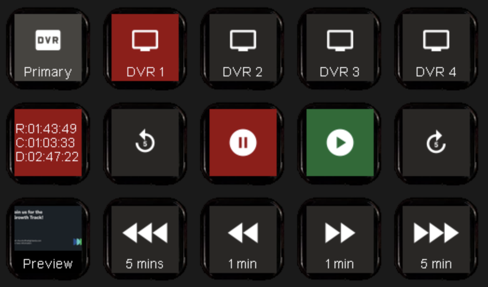

# Haivision Connect DVR Companion Module
This module allows for playback control of the [Haivision Connect DVR](https://www.haivision.com/products/video-services/connect-dvr/), allowing it to run headless and without a typical web browser controller.

This module has been tested on versions 4.2.0-4.7.0 of the Connect DVR software, and has been used in multiple and various production environments since April 2019. The controls have also proven to be more reliable than stock control methods for live environments.

## Features
### Controls
- Loading/playing channels
- Play/pause
- Live output scrubbing (forward/backwards controls, "skip time")
- Go to time on current channel
- Setting and recalling cuepoints
- Rebooting device (if using admin login)

### Feedbacks
- Channel is active
- Channel is currently downloading/streaming
- Output screen is playing/stopped
- Cuepoints feedback (if saved), offering a screenshot and/or color changes
- Preview image of current output

### Variables
- Time played
- Duration of current clip
- Time remaining
- Variables can be used in go to time areas, useful for if you have multiple DVRs for syncing them together; for example, $(de:time) can be used on another device to roughly sync times together