## SportInTheBoxVersion In The Box 2 plugin

Sport In TheBox is a powerful production and playout system that allows the user to create engaging live content and output it to video boards, in-house tv systems and streaming.

It handles playout of stored images and videos, live video inputs, replays and graphics for both full screen scoreboards and overlays for TV.

With great flexibility SportInTheBoxVersion In The Box can output almost any format and resolution to adapt with custom video screens, making it the ideal solution for both smaller clubs and larger arenas.

Sport In The Box In The Box can have multiple live video inputs with SDI, HDMI or NDI and the output windows can be placed in any size and position on the desktop to adapt to the LED-screens used, taking away the need for a video scaler.

For more information and contacts visit [our website](https://www.iccmediasport.com/en/sport-in-the-box/)

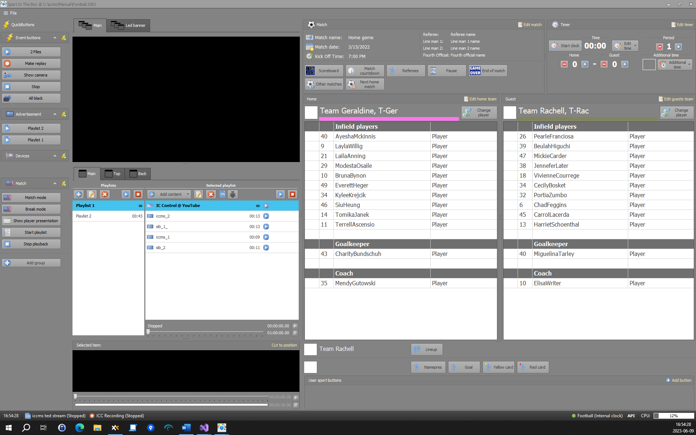

## Actions

### Trigger QuickButton

Best way to create QB action is to drag it from SIB presets.
All values will be filled.

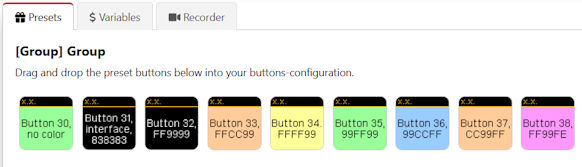

or select from list of possible actions in drop-down.

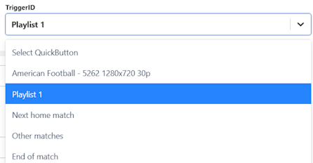

Plugin uses SIB api to fire QuickButton events via *Trigger ID*.

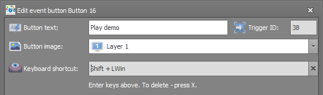

API password is set in *Settings -> General -> API*

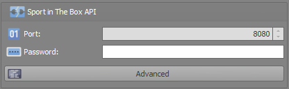

### Open database

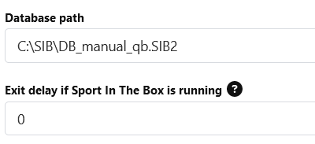

To open database, SIB v2.16 and above is required as well as SIB service
helper (can be found in tray area).

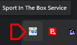

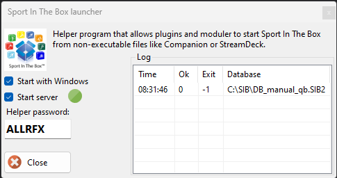

New password will be generated at first start and should
be set in the module *helper password* field.

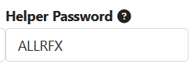

### Change team

Change team via preset. Home and guest team can be changes separately.

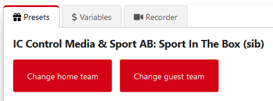

Inside preset, all teams are shown with team color and small team image.

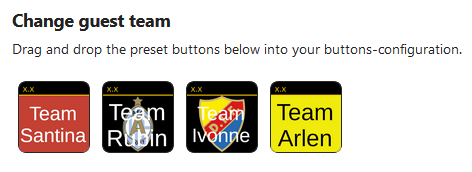

Once created, team can be changed with the action editor.

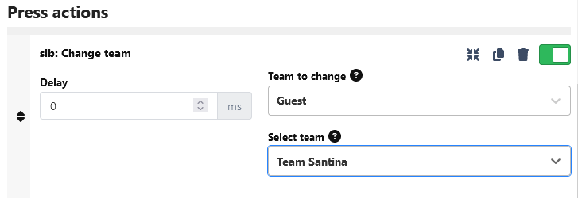
