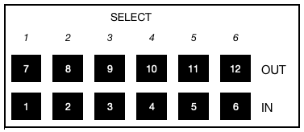

# Kramer Matrix

This module lets you to control Kramer Matrices using [Protocol 2000 (PDF)](https://k.kramerav.com/downloads/protocols/protocol_2000_rev0_51.pdf) or [Protocol 3000 (PDF)](https://k.kramerav.com/downloads/protocols/protocol_3000_3.0_master_user.pdf).

## Instance Configuration

_Consult your product manual for information about how to set an IP address and what your matrix supports._

1. Configure your matrix with an IP address and enter it into the `Target IP` field.
2. Choose the type of Kramer communication protocol your matrix uses, either Protocol 2000 or Protocol 3000.
3. Choose whether your matrix uses TCP (port 5000) or UDP (port 50000).

Enter the number of inputs, outputs, and presets your matrix supports. The module can auto-detect these settings if you leave those fields empty and apply your changes. Check the **Info** log in Companion to confirm the values were detected correctly. The `Counts` fields will show as empty until you refresh the page.

### Route command

Different models of matrices communicate differently, such as which command is needed to switch the audio or video inputs. Video-only matrices use `#VID` and video/audio matrices use `#ROUTE`.

### Disconnect parameter

Some matrices use `0` to disconnect an input from an output, while others use `number of inputs +1`.

To determine which your matrix uses, either experiment with the `Switch Video` action to see which works, or:

1. Open your matrix's manual.
2. Find the Protocol 3000 section and look for a **ROUTE** or **VID** section.
3. In the **Parameters** section, look for `0 (output disconnected)` or `5=OFF` (as seen on a 4x4 matrix).

## Actions

### Switch Audio

Changes the audio routing of inputs to outputs.

### Switch Video

Changes the video routing of inputs to outputs.

You can route a specific input to an output, an input to all outputs, or disconnect all outputs.

### Switch Audio (Dynamic)

Changes the audio routing of inputs to outputs, but allows **custom variables** to define those inputs/outputs. See Companion's **Getting started** guide for more information.

### Switch Video (Dynamic)

Changes the video routing of inputs to outputs, but allows **custom variables** to define those inputs/outputs. See Companion's **Getting started** guide for more information.

### Recall Preset

Recalls a stored preset (may be referred to as a _Setup_ in the manual).

Consult your matrix's manual to see how the numbering of the setups compares to physically using the front panel, but here's an example from one of their 6 x 6 matrixes:

### Store Preset

Saves your current inputs and output configuration to a memory preset.

### Delete Preset

Deletes a stored preset (_not supported on Protocol 3000 matrices_).

### Front Panel

Allows you to lock or unlock the matrix's front panel. A locked front panel doesn't stop Companion from controlling the matrix.
