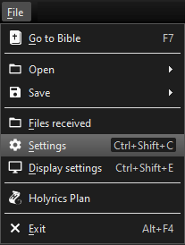
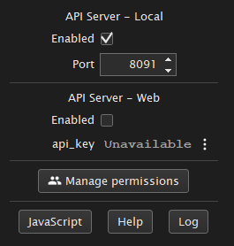
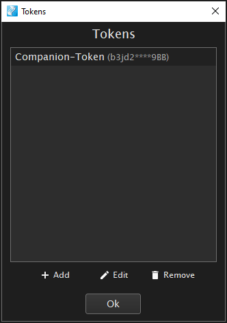
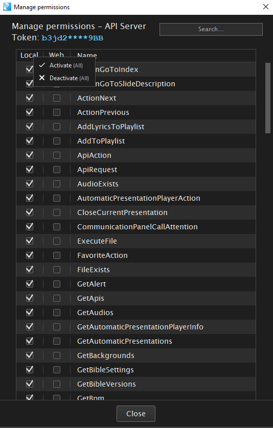

## Companion Module for Lima Giran Holyrics

To make use of this module, you need to enable the API in Holyrics. Go to the menu File > Settings > API server. 

Enable the "API server - Local" and choose a free port.

Then click on "Manage Permissions" and add a new token.

Highlight the newly generated token and click on "edit".
Grant all local permissions to the API token by left-clicking on the "Local" column header and choosing "Activate (all)".

Finally, right click the token and copy the token using the "token copy" option. You need the token when creating a new connection in companion.

For some commands an item ID is required, e.g. for the "Show Text" command. To obtain the ID right click the item in Holyrics and select the option "script info". You can copy the item ID Using the small icon shown next to the item ID.