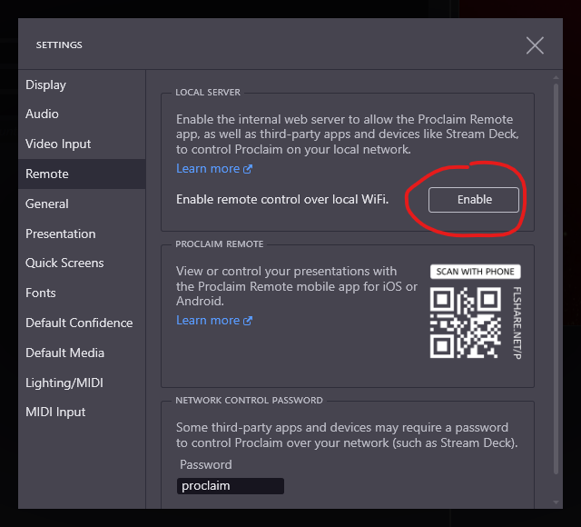
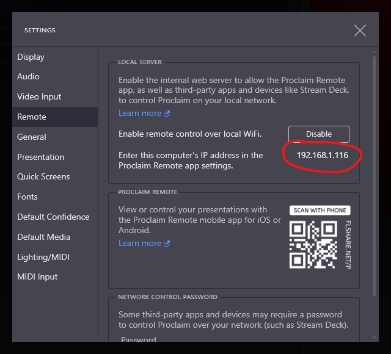
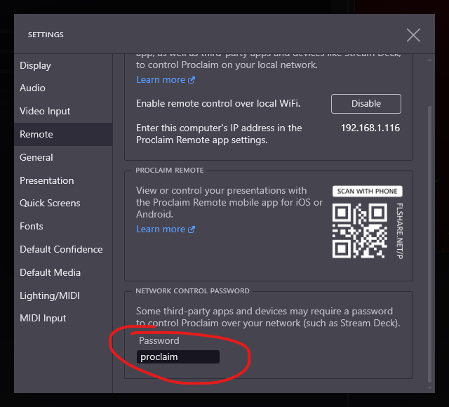
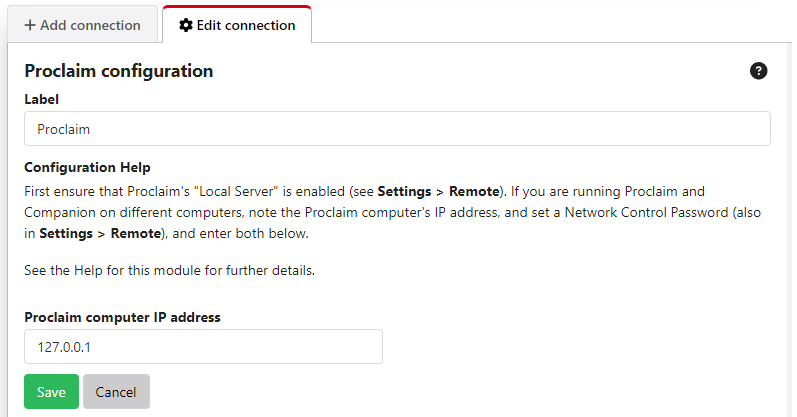
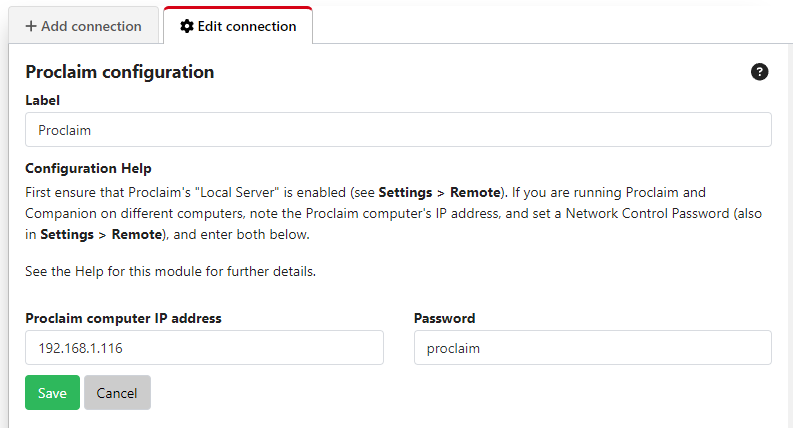

## Logos Proclaim

This module provides the ability for Companion to control [Logos Proclaim](https://proclaim.logos.com/),
a cloud-based presentation software built specifically for churches.

This module has been developed and tested with Proclaim version 4.0 upwards.

### Configuring Proclaim

First ensure Proclaim's local server is enabled. To do so, open Proclaim and go to **Settings > Remote**
and click **Enable**.

If you are running Proclaim on Windows, you may be prompted to allow Proclaim to
make a firewall exception for the port it needs to expose to allow remote control.

If you are running Companion and Proclaim on **different computers**,  first note down the Proclaim computer's
IP address:

Scroll down to **Network Control Password** in the Proclaim settings dialog and choose a suitable password.

### Configuring the Companion module

If Proclaim and Companion are running on the same computer, no configuration of the module is required and you can
leave the Proclaim IP setting with the default value of 127.0.0.1

If they are running on different computers, enter the Proclaim computer's IP address (which you noted previously),
then enter the Proclaim remote control password.

### Available commands

The commands available are:

### On air status

- Go On Air
- Go Off Air
- Toggle On Air

### Service sections

- Start Pre Service
- Start Warm Up
- Start Service
- Start Post Service

### Slides

- Next/Previous Slide
- Next/Previous Service Item
- Go to Slide - by number within the current service item
- Go to Service Item - by number within the service

### Song sections

- Go To Song Part - by part (Verse, Chorus, etc.) and index

### Media

- Previous Audio Item
- Next Audio Item
- Video Play
- Video Pause
- Video Restart

### Quick Screens

- Blank
- Logo
- No Text
- Floating Hearts
- Floating Amens
- Amen
- Hallelujah
- Praise the Lord!
- He is Risen
- He is Risen Indeed!

There are presets for all of these commands, including a useful "On Air" toggle button providing feedback.
