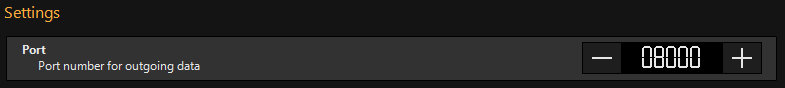

## Companion Module for Obsidiancontrol ONYX via OSC

This module should work for all recent ONYX versions (tested with Onyx 4.8).

# Features
* Main Playback Levels + Buttons (incl. feedback and cuelist names)
* Button Playbacks (Onyx provides no feedback for those)
* Generic Buttons (SELECT, GO, ...)
* Parameter Group / Effect Group selection (incl. feedback)
* Bank selection incl. feedback
* Device Space ID selection incl. feedback

# Configuration
* **Target IP** - the IP address or hostname where ONYX runs
* **Target Port** - the port to send OSC commands to; must match with the "Port number for outgoing data" in ONYX OSC (global) settings

 
* **Listen Port** - the port to listen for incoming updates; must match with the "Incoming port used by the OSC device" in ONYX OSC (device) settings

* For communication to work, you also have to set the correct IP address of companion to the ONYX OSC device settings
