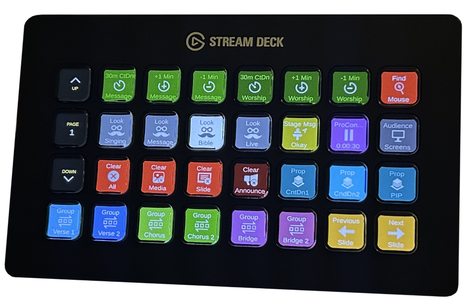
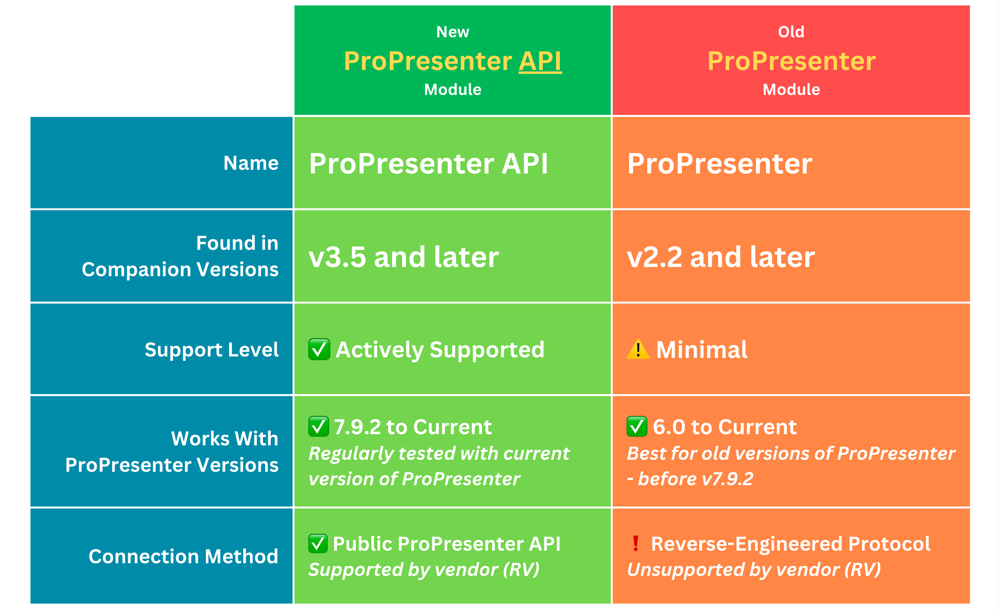
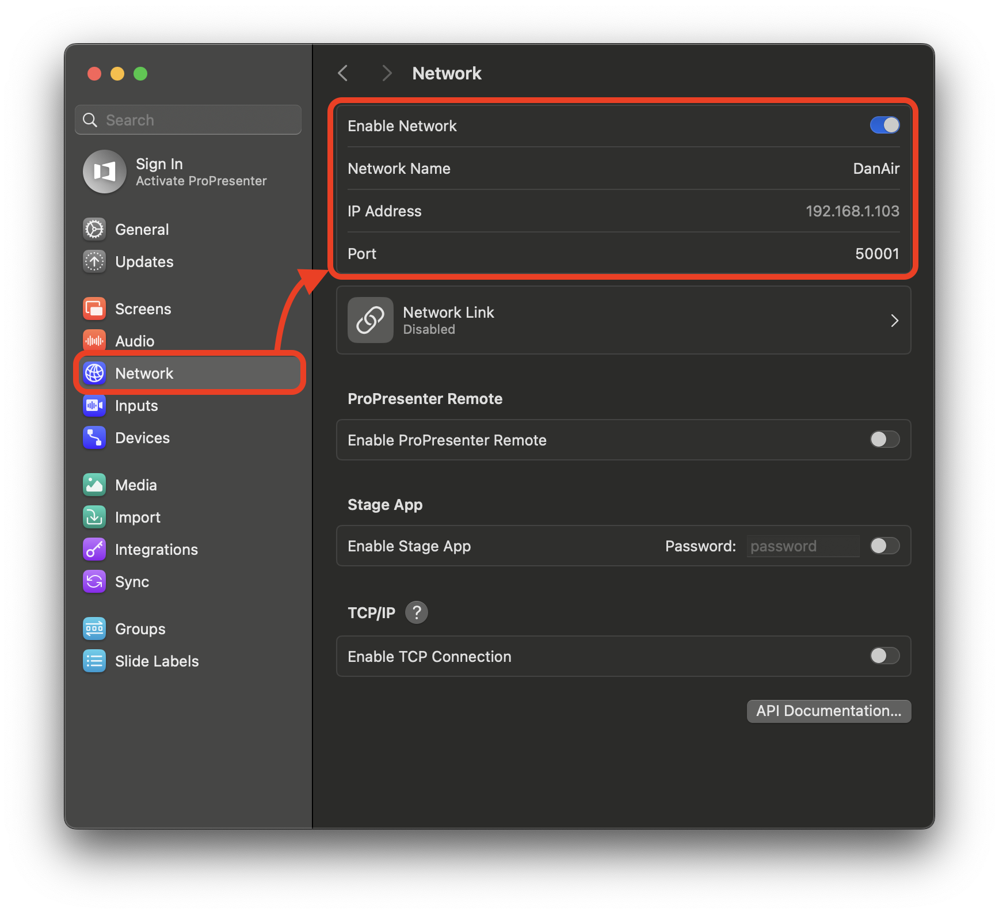
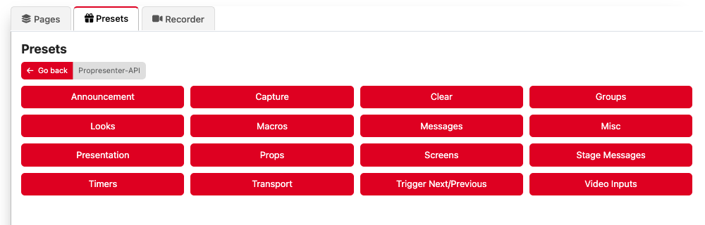
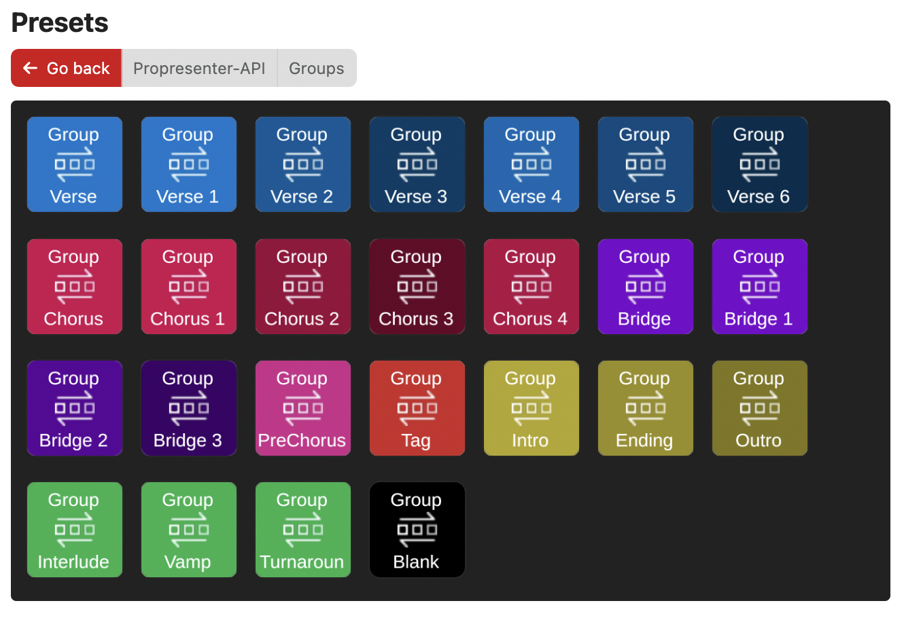
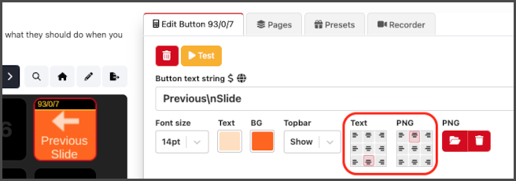

# ProPresenter API

This "**ProPresenter API**" module allows you to remotely control ProPresenter via it's <a href="https://openapi.propresenter.com" target="_blank">public API</a>  

If you like learning from videos - I am (slowly) building a <a href="https://youtube.com/playlist?list=PLfD8xdMvz-lhwcoJOOJ7G8qTEb_XXp6v4&si=2jViRELfYAFOUwYy" target="_blank">Youtube Playlist</a> of videos where you can learn more.  In time, I plan to include some walkthroughs of some pretty advanced setups.  
*But DON'T skip reading this help file! 😀*  

  
  
Starting with Companion 3.5 *and later*...
#### There are now TWO Companion modules for ProPresenter ####  
  
  
  
**Why TWO modules?**  
While it would have been ideal to update the old module to use both the old reverse-engineered remote protocol as well as the new vendor supported API, I wanted to get away from the supporting the reverse engineered code in the old module as it's becoming unsupportable. So I decided to make a completely new module that only uses the officially supported API.  
  
This does mean that all existing buttons/triggers/etc from the old module in your current setup will NOT be upgraded or imported into the new module. Those buttons/triggers/etc remain with the old module. There is no automatic upgrade path from the old module to the new module - you will have to build new buttons/triggers etc.

While this is not ideal, the main reason for this decision is SUPPORT - The reverse engineered code in the old module is not supported and no longer getting bug fixes from RV.  
  
Going forward, the new "ProPresenter API" module will **receive better and more reliable support.**  
  
**You can run BOTH modules at the same time...**  
It's perfectly fine to run BOTH the old and new modules side-by-side, connected to the SAME ProPresenter!  
There is no pressure to re-create your whole setup with actions from the new module and some users might need to run both for a while yet.  

Take your time to explore the new actions and features that the new module offers.  See if there is any new functionality that you want to add to your setup and over time, when you are ready, slowly add the new actions to your old buttons and disable the old actions while testing.  Once you have proven the new actions work for you, you can remove the old actions.  
  
Also, please note that the old module does have a few actions that are not (yet) supported in the official ProPresenter API and if you use those actions, you will want to keep using the old module alongside the new module.

Actions in old module that are not in new module:
- Specific Slide (In a **playlist**/presentation)
- Specific Slide With Label
- Specific Slide In A Group

  
**Remember - You don't have to choose!**  
Please don't forget that you can run BOTH modules at same time - connected to same instance of ProPresenter.  Keep running the old module version as long as you like or need to while exploring the new features in the new module version.  
___  
  

### 🐛 Reporting bugs 🐛  
If you have any issues, please check the <a href="https://github.com/bitfocus/companion-module-renewedvision-propresenter-api/issues" target="_blank">known issues list</a> - and add your issue if it's not already there.
  
---  

## How to Configure the Connection: ##  
This Companion module connects via a network connection to ProPresenter.  
You can run Companion on the same computer as ProPresenter or any other computer on the same network.  

To setup this module you will need the to do the following as a minimum:  
  
✅ **Enable Network** must be enabled in ProPresenter Network Settings.  
✅ Enter the computer **IP Address (or Hostname)** and the ProPresenter network **Port**  
  
Both the IP Address and ProPresenter port are shown in the network settings of ProPresenter.
  
  
There are optional and/or advanced settings that you may configure if you decide you want to:  
* **Custom Time format:** hh:mm:ss or mm:ss or ss (or any combination) is used to specify how you would like the time of timers to be formatted for the variables timer_ID_custom.  
* **MIDI Setup** See more details about that at the end of this help file!  
* **Extra Debug:** You would generally keep this off - unless you are troubleshooting/submitting an issue. In that case the extra debug info might help devs to find the cause your issue!
* **Suppress Warnings for ActivePresentation Next/Previous:** When this option is enabled, warnings are suppressed if you try to go to the next slide at the end of a presentation or the previous slide at the beginning but there is none available. (This applies only to the "Active Presentation: Operation -> Trigger previous/next Slide")
  
---  
## Getting Started:
### Button Presets:
The fastest and easiest way to define buttons is to use presets.
  
"Presets" are ready-made buttons with text, actions, feedback and some with nice icons. They are ready for you to simply drag and drop onto your StreamDeck pages. There are quite a good number of nice presets, organised in several categories, to get you started!  

  
For example, the "Groups" presets are dynamically created for all of the groups you have defined in your ProPresenter settings - just drag these onto a page to create buttons that trigger the first slide in these groups:

 
Even if you prefer manually building button actions and feedbacks yourself, the presets have some nice starting points (and icons) you might like to start (and learn from) when making your own custom built buttons.

If you want to use any of the PNGs from the module presets - here is a link to the <a href="https://raw.githubusercontent.com/bitfocus/companion-module-renewedvision-propresenter-api/main/IconPack.zip">IconPack</a>.

**❗️IMPORTANT NOTE ABOUT PRESETS❗️**  
Please note that all the presets are designed for FULL BUTTON display with the "TopBar" turned off in Companion settings. You might want to consider turning off the topbar when using these preset.  If, however, you prefer to show the topbar on your buttons, you will have to manually re-format the layout of the text and images on the preset buttons.  

Reformatting Tip: One way to reformat for buttons with topbars is to put 1-2 lines of small text at top/bottom and image at opposite bottom/top:

  
---  
### Actions:
For those that want to build their own buttons (and triggers) - you will want to explore and get familiar with all the available actions that you can add to your buttons and triggers.
  
Before you get started exploring the module actions, it will help if you become familiar the concept of  
**ACTIVE vs FOCUSED vs SPECIFIED** in ProPresenter.  Many actions are organised around this concept.  
This is described below:
  
**ACTIVE:**  
When you trigger a slide in a presentation, that presentation becomes the "ACTIVE Presentation".  
The slide that you triggered has an Orange border to show it's triggered/live.  
  
Did you know that you can click on another presentation to view it while the slide that you previously triggered  **stays live**?... This is not a common thing you might do - but you *can* go "wandering off" and look at other presentations while your triggered slide in the "ACTIVE Presentation" **stays live**.  With that in mind, let's introduce the concept of the FOCUSED presentation:  
  
**FOCUSED:**  
Any Presentation that you are *looking at* is the "FOCUSED Presentation".  
  
You can focus (click to look at) any presentation you want without making it ACTIVE.  It becomes the ACTIVE Presentation if/when you click a slide in that presentation. Also, note that if you clear the slide/all, the ACTIVE presentation at the time of clearing, stays the ACTIVE presentation.  
  
**ACTIVE vs FOCUSED**
This same concept of ACTIVE vs FOCUSED is also true for all presentation playlists, media playlists and audio playlists.  

This is an important concept to understand when choosing to add an action to add to a button (or trigger). Start with this question in mind: "Which one of these do I want to take an action on - the ACTIVE thing or the FOCUSED thing"  

The actions are named to be clear about which they work with.  
eg  
**Active Presentation Operation** will provide you a list of operations you can perform on the ACTIVE presentation.  
While **Focused Presentation Operation** will provide you a list of operations you can perform on the FOCUSED presentation.  
  
To really see the difference you might experiment and explore the difference between triggering the "next" slide in the Active presentation vs the "next" slide in the Focused presentation. Try these both while one presentation is active and a different presentation is in focus!
  
**SPECIFIED:**
Finally, in addition to performing actions on the the thing that is active or focused, you can also perform actions on a specific thing - by giving some form of identifier (See **Specific Identifiers** below).

### Compound Actions
Once you figure out what you want to target and choose an Action that targets what you want, you will notice that within most actions there are multiple commands/operations you can select from.
Explore the operations within each action to get familiar with what is possible.  

### Variables
This module provides a number of variables that reflect the current status of things in ProPresenter. Take a look and explore these variables - you might like to use some of them for live button text.  
Also, variables are supported throughout the module in many actions inputs - It might not be obvious at first - but when you see a DropDown to pick something, check the last item on the list - there is usually a manual option you can pick which will allow you to enter text or variables (See below for more on variabbles)  

### Specific Identifiers - UUID
Many things in ProPresenter can be indentified by using ANY one of three identifiers: UUID or Name or Index.  
A UUID is a special globally unique identifier that ProPresenter has assigned to many objects. Once you figure out what somethings UUID is it can be used indentify that object "forever".  For now, the easy way is to look through the module variables - there are several variables that show the UUID of things - eg the active presentation.  
Be careful with UUIDs - UUID of playlist items and UUID of presentations are not the same!  Generally, using names and indexes are often the easiest way to specify something (see below).
In addition to UUID's - you can also use **Names** as identifiers. Using names is probably the most easy option and fine for most uses!  
Finally, you can also use Index to identify things (esp slides). Please note that Index counting starts at 0.  The first item in any group/list of items is index 0 (not 1).  

### More Info On Actions
* Note that setting a timer will change it's name if you do not perform an operation...and will set it's "allows Overrun"
* Hover your mouse on the ? icon above Action inputs for useful tips/instructions.  
* Explore the button presets as great starting points/inspiration for the kinds of things you can do.  
* The Trigger Next/Previous operation, targeting Presentation focuses the active slide - It scrolls to ensure the active slide is visible.  It might be the only way to focus the active slide - as all other trigger operations on Active or Focuses presenation don't seem to do this.  They trigger slides without ensuring the triggered slide is visible.
  
---  
### Variables:
Can be used on button labels - can be used in many action inputs.
Some variables are dynamically created so that there are variables for each thing - eg timers, stage display layouts.  
When looking at the Variable ID's you will notice that the uuid is sometimes included -  which makes for a bit of a confusing/long ID, but this long ID is globally unique and allows these variables to always work even if the names have duplicates.  
Note that, the Variable description has a nice friendly name.  
Note also that the variable "Active Presentation Index" seems to mostly return invalid indexes but I am keeping it available for the future, in case it becomes useful in a future version of ProPresenter  For now, you probably want to use "Active Presentation PlaylistItem Index" instead.
One special variable is Time Since Last Status Update - for debugging purposes. (You can even Trigger the module to automatically restart when the "Time Since Last Status Update" gets over some appropiate limit - Although hopefully you never need to!)  
  
---  
### Feedbacks:
Feedbacks are typically used to update a button to show the state of something - Take a look at some of the presets to get an idea of how some of the feedbacks provided by the module can be used.
  
---  
### Other Notes:
Note that a few API functions were introduced in later versions of ProPresenter so there might be one or two actions that don't work if you are running an older version of ProPresenter.  
  
Find My Mouse - handy for setups with multiple screens using native outputs.  
  
Arrangements - Do you use arrrangements? - If you want to do some actions that rely on knowing about presentation arrangements, you will have to wait for a future API update by RV. API support for working with arranged presentation is conspicuously missing from the current API.  There are no endpoints that include any arrangement info. Consequently there is no reliable way to get total slide count of a presentation (seems odd doesn't it)  
  
Messages: Triggering supports text tokens only (Showing a dynamic number of text tokens for each select message, hurt my brain a bit - I kinda dread adding timers to the mix.  For now, timers can be configured and started seperately)  
  
If you use  to "Specific Presentation: Operation"/"Tigger Slide By It's Index" to trigger a specific slide in a specific presentation that is not the currently active presentation in a playlist...  
...you might expect a subsequent call to "Active Presentation: Operation"/"Focus Active Presenation" to change focus to it within that playlist...  
.. but it does not, instead, it will focus the presenation you specified but in the library it lives in.  
You can however, trigger the **first** slide in *any* specific presentation in a playlist using "Specific Playlist: Operation"/"Trigger Playlist Item By It's Index" and then once it's the active presentation you can then trigger specific slides within it with "Specific Playlist: Operation"/"Trigger Slide By It's Index"
  
Variables are not "reset" when disconnected or connection is lost - the last knwon values just stay!  
  
Many dynamic variables use UUID in ID instead of name - Names can contain invalid characters for variable names. Also, ProPresenter allows duplicates names for items and Companion variable names must be unique.  This has the drawback of not being very readable when reading expressions tha contain these variables.  The nice thing about uuid is that it never changes - so you can rename objects as often as you like in ProPresenter and the _uuid_ style variables that refer to them will continue to work.  
  
The Set operation for a timer allows you to rename it - but ONLY IF you choose "None" for the optional operation.  
When using a Timer set action to update a timer, I have seen that doing an operation (start/reset) too soon after you have updated it seems to revert the changes made by timer set action - wait a little while or use the option to set AND perform operation.  
  
A momentary flash of warning symbol will appear on all buttons with ProPresenter actions when a request fails - check debug log for details. (prob invalid input in an action for a button or trigger)
  
Looks are identified by name or index.... UUID of live look does not match any UUID of the list of configured looks. So we can't use UUID for identifying a look to trigger.  
  
  
## 🎹 Simple MIDI Button Pusher: ##  
There is an optional feature added to this module which enables remote pushing of Companion buttons via MIDI.  
If you enable it, you can send a **Note-On** message to this module through a shared MIDI-Port and cause a button press.  
This feature uses a very simple mapping of Note-On MIDI messages to buttons in Companion:

Midi Channel = Button Page.  
The numerical value of the Note-On = Row of button.  
Note-On Intensity = Column of button.  

In the module config, enable the MIDI Button Pushing and then choose an existing MIDI port in the "Midi Port" dropdown.
If you like, pick the last option in the Midi-Port Name dropdown called "Custom Virtual Port" to create a local (non-networked) custom virtual port with any name you choose.  

You need to make sure the Companion is listening on 127.0.0.1 (or "All Interfaces" 0.0.0.0). Also you will need to enter the port number that your Companion is configured to listen to, *if you have changed it from the default of 8000*, as there is no way for this module to "know" what port your Companion is listening on.  (This Port is configured in the main window of Companion).  
   
Tip: You can setup as many MIDI ports are you like in MacOS or Windows (Windows needs 3rd party software). Make sure that the MIDI port you setup for this is just for Companion and ProPresenter.  Also, make sure it is only used as a *destination* and NOT a *source* in ProPresenter MIDI settings - otherwise you will probably feedback MIDI notes that you intend to send out to this module, straight back into ProPresenter, and they will trigger unintended actions within ProPresenter itself.  
