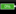

# Sennheiser EW DX Series

## Getting started

Just select the device from the module config window and enter the control IP of your EM2/EM4 receiver or network charger and press 'Save'. To control multiple devices, just add the connection several times to your Companion instance.
For receivers with firmware >= 4.0.0 : please enable the "Legacy Mode" in the Sennheiser WSM Software for the receiver, to be able to control the devices using the SCP v1 protocol. If this is not done, you can't control your devices via Companion at this point.

### Variables

This module stores pretty much all information the connected devices provide - some of them are available as feedbacks - but not all of them! So make sure to explore the "Variables" tab in Companion, to get an overview about all available information (e.g. Mounted Capsule on SKM, Battery charging cycles, transmitter type, etc.)

### EM2/EM4 Status Display Explanation

In the module presets you will find a status display for every receiver channel of your device. It contains the following information:

- Battery Percentage
- Receiver channel name
- Frequency
- RSQI

Beside this information the following icons are used:

 AF Peak

 Warning - one or more warnings are currently present on the receiver channel

 Encryption - Disabled

 Encryption - Enabled

 Encryption - Error (for example because Encryption was disabled and enabled again without syncing the transmitters again)

 Muted - Either the transmitter or receiver is muted

 RSQI - Good signal (> 70%)

 RSQI - Medium signal (> 40%)

 RSQI - Bad signal (>= 1%)

 RSQI - No signal / No RSQI information (0%)

 Antenna - A is currently receiving

 Antenna - B is currently receiving

 Battery - Shows the remaining battery percentage (> 50% Green, >= 20% Yellow, < 20% Red)

When the RX identification is active (either by triggering from Companion or by pressing the Power Button on a transmitter), a green bar at the bottom of the button is shown. If you are using the preset, the identify action will be already assigned to the button.

### CHG 70N Status Display Explanation

In the module presets you will find a status display for every charging bay of your device. It contains the following information:

- Battery charging Percentage
- Remaining charging time (in minutes)
- Device Type (which device is currently being charged: SKM, BA70, etc.)

Beside this information the following icons are used:

 Warning - one or more warnings are currently present on the charging bay

 Charging Error - The battery can either not get charged or discharged

 Communication Error - The charger can't communicate with the battery

 Temperature Error - The battery temperature is outside of the supported range (either too cold or too hot)

 Overcurrent Error - An overcurrent was detected

 Bay State: normal

 Bay State: not normal - the current bay state is either UPDATE, ERROR, or DFU_MODE

When the bay identification is active, a green bar at the bottom of the button is shown. If you are using the preset, the identify action will be already assigned to the button.
