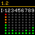
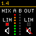

## Shure DCA901

This module will connect to the Shure DCM901 Broadcast Microphone Array to provide control and feedback status.

### Available actions

| Title                     | Support |
| ------------------------- | ------- |
| Set channel name          | All     |
| Set channel mute          | All     |
| Set channel gain          | All     |
| Increase channel gain     | All     |
| Decrease channel gain     | All     |
| Flash lights on the mixer | Mixer   |

### Available feedbacks

| Title                  | Type   | Support              | Description                                                                                                                        | Preview                                                      |
| ---------------------- | ------ | -------------------- | ---------------------------------------------------------------------------------------------------------------------------------- | ------------------------------------------------------------ |
| Input Levels Display   | Icon   | Channels 1-8, Aux In | Shows 8 segment meters for inputs 1-9                                                                                              |      |
| Output Levels Display  | Icon   | Channels 1-8         | Shows 8 segment meters for direct outputs 1-8                                                                                      |    |
| Mixer Levels Display   | Icon   | Mix A & B            | Shows an 8 segment meter, limiter status, and mute status for both mixers                                                          |      |
| Channel Status Display | Icon   | Channels 1-8, Aux In | Shows an 8 segment meter for the channel in and direct out, gain, gate status for mixers A & B, mute status, and DFR assign status |  |
| Mixer Status Display   | Icon   | Mix A & B            | Shows an 8 segment meter, IntelliMix Mode, gain, limiter status, mute status, and DFR assign status                                |      |
| Channel Mute           | BG, FG | All                  |                                                                                                                                    |                                                              |
| Channel Gain           | BG, FG | All                  |                                                                                                                                    |                                                              |
