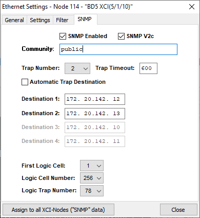
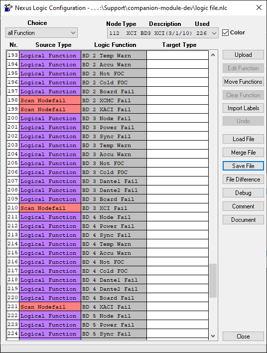

## Stagetec Nexus XCI

- [Stagetec XCI](https://www.stagetec.com/en/nexus-modular.html)

This module is a SNMP trap reciever optimised for the logic configurable traps from the Stagetec Nexus XCI. It allows boolean feedbacks to be created and used to trigger events in Companion based on Logic configured in Nexus Service.

Each XCI card is capable of 256 logic configurable SNMP traps. NB. In the test system the 256th logic cell doesnt report an OID correctly.

### Configuration

**XCI IP**

The IP of the XCI card. Any traps recieved from other IPs will be ignored.

**Community String**

The community string set on the XCI. Any traps recieved with a non-matching community will be ignored.

### XCI Configuration

Configuring the XCI to trigger SNMP traps requires use of Nexus service.

In the ethernet configuration window select the XCI card and navigate to the SNMP tab.

Ensure SNMP is enabled. Set the community string and the trap number to at least one. One of the destination IPs should be the host IP of the companion computer. This module will work regardless of if the XCI is in SNMP V1 or V2c mode.

SNMP traps will only be triggered from logic cells according to the settings in "First Cell Number", "Logic Cell Number" and "Logic Trap Number".

Logic configuration to trigger the traps is then done in the Logic section of Nexus Service.

Both the network settings and logic configuration must be uploaded to the nexus system once the respective changes are made.

### Note on use

Since this module just listens for SNMP traps, it does not pickup the state of logic cells at module initialisation. All feedbacks are initialised to false.

### Actions

- **Reset Count**

Reset the specified count variable to zero.

- **Reset Latch**

Reset the specified latch variable to false.

### Variables

- **Logic Cell Count [ 1 - 256 ]**

Increments when a SNMP trap is recieved setting the cell to true.

- **Logic Cell Latch [ 1 - 256 ]**

Goes true when a SNMP trap is recieved setting the cell to true. Stays true until reset.

- **Most Recent Trigger**

Returns the cell number of the most recently recieved true SNMP trap.

### Feedbacks

- **XCI SNMP Trap**

Follows the state of the specified SNMP trap

- **XCI SNMP Trap - Latched**

Goes true when triggered by a Trap. Stays true until reset.

## Version History

### Version 1.3.0

- Pass Shared UDP Socket to SNMP agent so multiple instances can be run at once
- Let Companion parse variables
- Abort actions and feedbacks by throwing errors
- Replace isVisible properties with isVisibleExpression
- Update dependencies

### Version 1.2.2

- Parse local variables

### Version 1.2.1

- Use Node 22
- Update dependencies

### Version 1.2.0

- Add count variable and reset action
- Update dependencies

### Version 1.1.3

- Update dependencies

### Version 1.1.1

- Add latching feedbacks to complement variables
- Update status on absent XCI IP

### Version 1.1.0

- Accept variables for feedback cell input
- Add 'most recent' variable, displays the cell number of most recently received positive going trap
- Add cell latch variable, and reset action. Goes true when triggered by an SNMP trap, and stays that way until reset
- Update companion-module-base to 1.8.0
- Update net-snmp to 3.11.2

### Version 1.0.2

- Initial release
