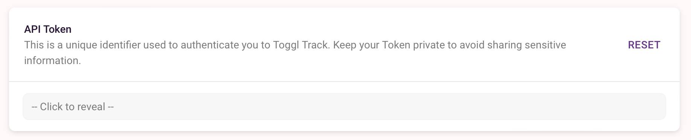

# Companion Module Toggl Track

This module allows you to start and stop [Toggl Track](https://track.toggl.com/) timers.

## Configuration

Before using this module you must create a Toggl Track account. Then go to your Toggl profile settings page and copy the API token. Look for this section on your toggl profile.

Paste this token into the config page of this module and click save. If all is well the module status will turn green.

## Actions

**Start New Timer**

Start a new timer running with the description set in the action and store the ID. If a list of projects has been retrieved on startup you can choose a project. By default a new timer can't be started if one is already running. This behaviour can be changed by ticking the 'Always Start' option in the module configuration.

**Get Current Timer**

Companion only knows the ID of timers it has started. If you did not enable time entry poller you can use this action to poll the current time entry, if a timer is started from another application or the toggle website so Companion knows about it.

**Stop Current Timer**

Attempt to stop the current timer. This will fail if Companion doesn't know the ID of the currently running timer.

**Refresh Project List**

Retrieves the current list of projects from the toggl server. This action runs automatically when Companion starts and when the module is enabled.

## Presets

Presets are available for **Start Timer** and **Stop Timer**.

## History

### Version 1.0.0

- First release

### Version 1.0.1

- Fix broken link

### Version 1.0.2

- Allow a project to be specified when starting a new timer button
- Add an action to refresh the project list
- Add 'Always start' configuration option

### Version 1.0.3

- Add variables for timerId and timerDescription

### Version 2.0.0

- Updated for Companion version 3
- Updated for toggl API version 9

### Version 2.0.1

- Make the API token config field required
- Fix manifest file

### Version 2.1.0

- Rewrite module in typescript
- Use module toggl-track instead of implementing api on our own
- Add status reports for some failure cases in connections dashboard
- Add configurable time entry poller
- Add feedback for currently running project and client
- Update timerDuration to contain the correct duration formatted as time string

### Version 2.1.1

- Prevent module crash if user has no Clients
