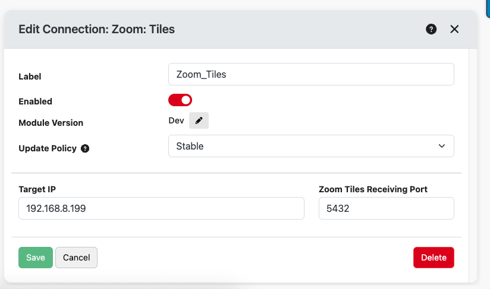
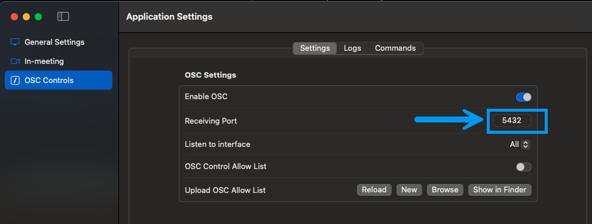
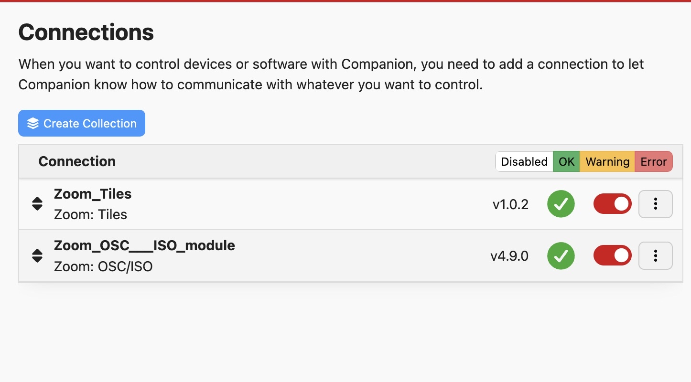
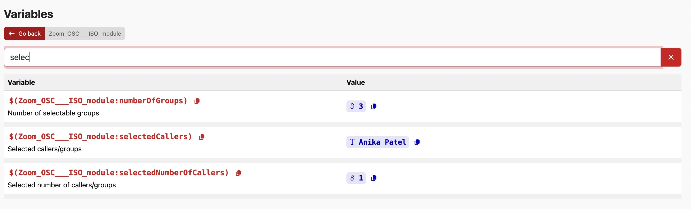
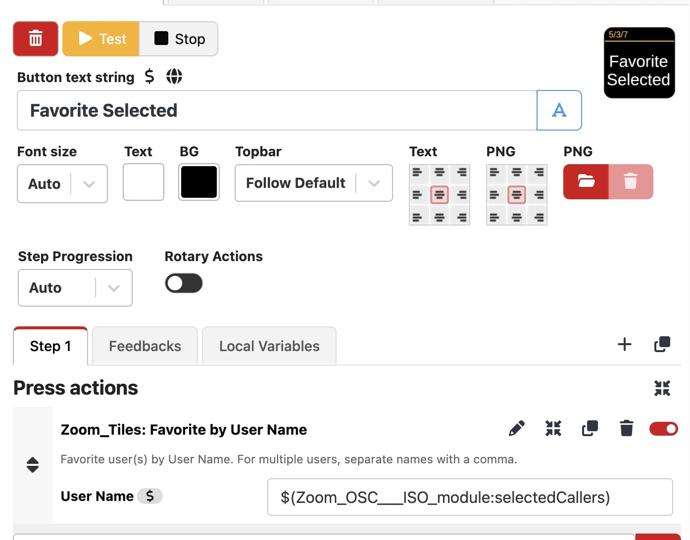
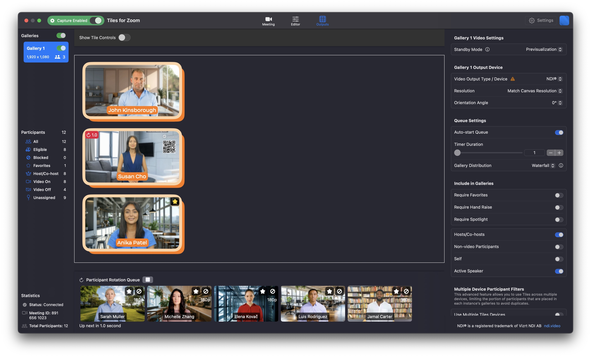

# Zoom Tiles

This module is for the [Zoom Tiles](https://www.liminalet.com/tiles) application.

> The minimum version for Zoom Tiles is v1.2.0.

## Configuration

To configure this module, you need to provide the following settings:

- **Target IP**: The IP address of the computer running Zoom Tiles application
- **Zoom Tiles Receiving Port**: The port number that Zoom Tiles is listening on (default: 3456)

Within Tiles, you can find the port number to use and you also need to make sure that the OSC commands are turned on.

## Dynamic Participants in By User Name Actions

You can leverage the participant selection workflow from the ZoomOSC Companion module with the Zoom Tiles OSC actions to dynamically select the participant(s) for the "by user name" action to take action on.

> Note: one of the advantages of using this module over just a generic OSC connection for Zoom tiles, is that all of the Zoom Tiles By User Name actions allow you to take action against multiple users at once.

To enable the dynamic participants list using ZoomOSC, follow the steps below:

1. You’ll need the ZoomOSC/ISO module and this module.

   

1. In ZoomOSC, click the button that has the participant on it so that it gets added to the selectedCallers variable.

   

   > To enable multiple user selection, in ZoomOSC, run the action Selection method and set it to Multi Select or Toggle it to Multi Select.

1. In ZoomOSC, when you select someone it populates a variable in the Companion variables list for the ZoomOSC module called `selectedCallers`. In this example, Anika was selected. Copy this variable name using the red copy button on the left.

   

1. When you add a "By User Name" action, for the user name field, instead of typing a static name, paste the variable name you copied (`$(zoomOSC:selectedCallers)`).

   

   > You can find all of the "By User Name" actions by searching in the Action list for By User Name or searching this document for the action names.

1. Now when you press the key that has the "By User Name" action, it will take affect on the participant that was selected in Companion . For our example, we did Favorite by User and notice the star on Anika in the Tiles favorite list.

   

This workflow works for all of the Tiles By User Name actions.

## Supported Actions and Feedbacks

### Block

Block actions prevent specific participants from appearing in your gallery views.
UnBlock actions allow previously blocked participants to appear again.
You can block/unblock by user name or by their position in a specific gallery.

| Name | Description |
| --- | --- |
| Block by Index | Block a tile using the gallery index and tile index. |
| Block by User Name | Block user(s) by User Name. For multiple users, separate names with a comma. |
| UnBlock by User Name | UnBlock user(s) by User Name. For multiple users, separate names with a comma. |

### Capture

Capture actions control the Zoom Tiles capture engine.
Start capturing to begin recording video tiles, stop to end the capture session.

| Name | Description |
| --- | --- |
| Start Capture Engine | Start the capture engine to begin capturing video tiles. |
| Stop Capture Engine | Stop the capture engine to end capturing video tiles. |

### Config

Load a Zoom Tiles configuration file to quickly apply saved settings.
Configuration files must be stored with an absolute path on the system running Zoom Tiles.

| Name | Description |
| --- | --- |
| Load Configuration | Load a configuration file from an absolute path on disk. |

### Favorite

Favorite actions mark participants to ensure they remain visible in your gallery views.
UnFavorite actions remove the favorite marking from participants.
You can favorite/unfavorite by user name or by their position in a specific gallery.

| Name | Description |
| --- | --- |
| Favorite by Index | Favorite a tile using the gallery index and tile index. |
| Favorite by User Name | Favorite user(s) by User Name. For multiple users, separate names with a comma. |
| UnFavorite by Index | UnFavorite a tile using the gallery index and tile index. |
| UnFavorite by User Name | UnFavorite user(s) by User Name. For multiple users, separate names with a comma. |

### Gallery Timer

Gallery Timer actions control gallery view rotation and visibility.
Use queue timers to automatically cycle through participants, enable/disable specific galleries, and activate hole punch for transparency effects.

| Name | Description |
| --- | --- |
| Activate Hole Punch | Activate hole punch for a specific gallery view. |
| Deactivate Hole Punch | Deactivate Hole Punch for a specific gallery view. |
| Disable Gallery | Disable a specific gallery view. |
| Enable Gallery | Enable a specific gallery view. |
| Start Queue Timer | Start the queue timer for gallery updates. |
| Stop Queue Timer | Stop the queue timer for gallery updates. |

### Join Leave

Join and leave Zoom meetings directly from Companion.
Start your personal meeting, create an instant meeting, join with Meeting ID/Password, or use ZAK tokens for authenticated joins.

| Name | Description |
| --- | --- |
| Join Meeting | Join a meeting with Meeting ID, Password, and Display Name |
| Leave Meeting | Leave the current meeting |
| Start Instant Meeting | Start an instant meeting |
| Start Personal Meeting ID | Start a meeting using your Personal Meeting ID |
| ZAK Join Meeting | Join a meeting using ZAK token, Meeting ID, Password, and Display Name |

### Replace

Replace actions allow you to swap participants in gallery views.
You can replace by user name, tile index, or a combination of both.

| Name | Description |
| --- | --- |
| Replace by User Name | Replace user in the gallery with a new user regardless of where they are in the gallery. |
| Replace Tile Index in a Gallery with a New User | Replace a Tile Index with a specific User. If both users are already in the gallery then they swap places in the gallery |
| Replace Tile Index with Tile Index | Replace a Tile Index with another Tile Index. |
| Replace User with Tile Index | Replace a user with a specific gallery/tile index. |
